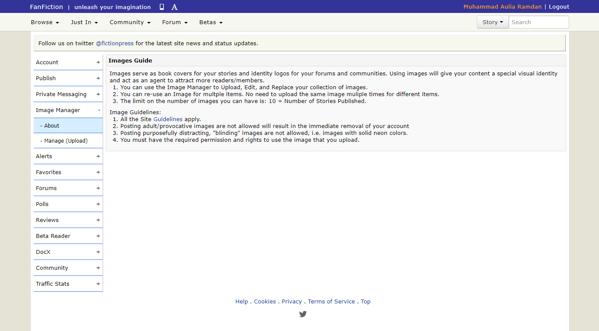

# assignment-0-ramdan0cool
assignment-0-ramdan0cool created by GitHub Classroom

Profile: \
Muhammad Auliaramadani \
05111640000062 \
HCI- A

## Assignment 0: Examples of bad designs
### 1. Internet Explorer
**Brief Description:** \
Internet Explorer is an internet browser released in 1995, discontinued but maintained today. Internet Explorer was once the most widely used web browser, attaining a peak of about 95% usage share by 2003. Its usage share has since declined with the launch of Firefox (2004) and Google Chrome (2008), and with the growing popularity of operating systems such as Android and iOS that do not run Internet Explorer.

**Personal Opinion:** \
This browser will cause many inconveniences for its users. For one, the menu bar is hidden by default, so anyone trying to see history will need to know the shortcut. Else, they can't see their history. Same thing applied to downloads and bookmarks as well.

**Problems:**
1. Hidden menu bar by default
2. Hidden way to unhide the bar by default
3. Very minimalistic. Only suitable for simple browsing

**Suggestions:**
1. Unhide the menu bar
2. Add a side bar or proper address bar

.png)

### 2. Fanfiction.net
**Brief Description:** \
Fanfiction.net is a website spesifically for fan fictions of many media, from books, to video games, to movies. Users can read many fan fictions of their choosing, or pick a random choice. The website has a forum and a community of their own. Users who complete the free registration can create and publish their own stories, maintain profile, and comment/review other stories.

**Personal Opinion:** \
For a website spesifically for archiving stories, this website is a good one. That is it. Not much can be said for this website. The design of this website is highly arguable, from artistic point of view, the design provide a simple and clean UI, and makes the users comfortable. Yet not many people feel this design interesting, and most of the time, only those who love to read may feel attracted to this website. Others, not so much.

**Problems:**
1. Very simple UI.
2. Design does not change for a long time.
3. First time writers may have a difficulty trying to publish their stories.

**Suggestions:**
1. Simplify the clustering of objects
2. Fill empty spaces
3. Move the sidebar to navbar in User section

### 3. Reddit.com
**Brief Description:**
Reddit (/ˈrɛdɪt/, stylized in its logo as reddit) is an American social news aggregation, web content rating, and discussion website. Registered members submit content to the site such as links, text posts, and images, which are then voted up or down by other members. Posts are organized by subject into user-created boards called "subreddits", which cover a variety of topics including news, science, movies, video games, music, books, fitness, food, and image-sharing. ([Source](https://en.wikipedia.org/wiki/Reddit))

**Personal Opinion:**
On first look, Reddit drsktop seems rather uninteresting compared to its andtoid counterpart. The way posts shown on homescreen is uneven, and if it's a long post, will make it look just like a generic blogspot, something a website made for having and sharing funny or amazing moments should try to avoid.

**Problems:**
1. Lackluster posts positioning
2. Uneven length between posts.
3. Less attractive than android counterpart

**Suggestions:**
1. Even out the posts length, by hiding the rest of the post or making a grid like layout.

Credits:
[Wikipedia.com](Wikipedia.com)

Guest Star:
Ai
[Video here](https://github.com/hci-a-if-its-2019/assignment-0-ramdan0cool/blob/master/Internet%20Explorer%20%2B%20Reddit.mp4)     
